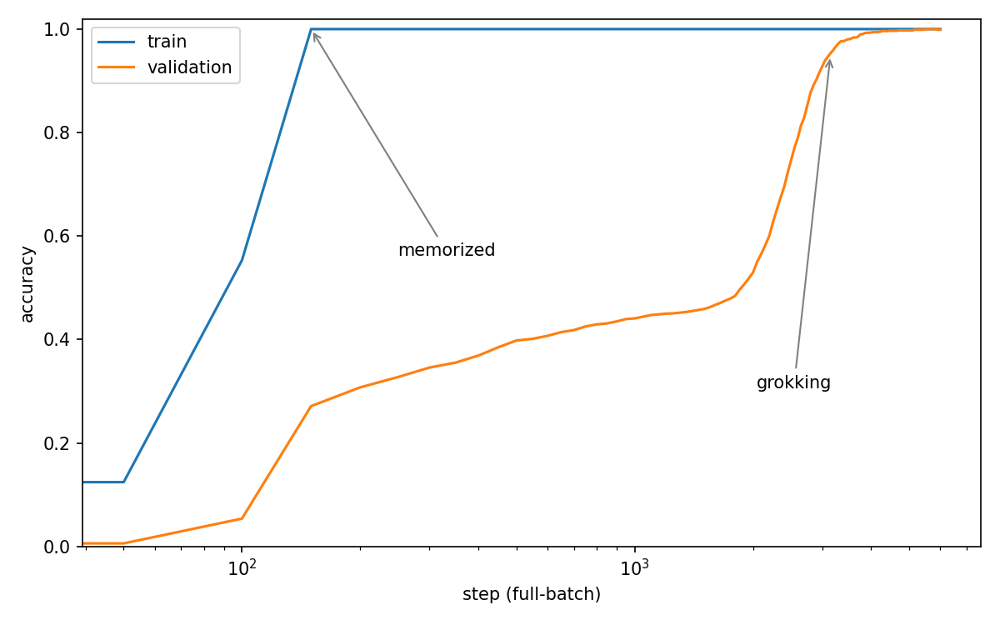
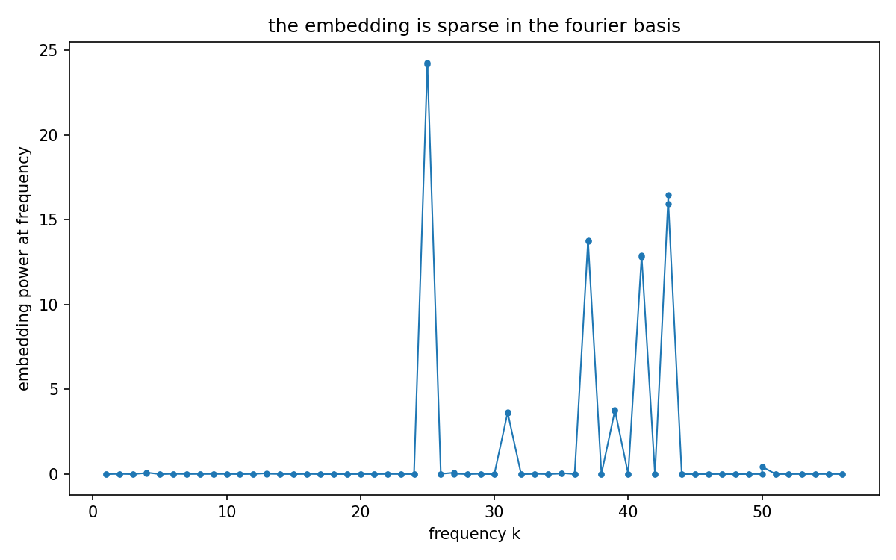

# nanogrokking

A one-layer transformer learns modular addition, memorizes the training set, stays at chance on held-out pairs for thousands of steps, and then suddenly generalizes. That delayed jump is called grokking. This repo reproduces it from the original paper, small enough to run on a weak laptop with no GPU.



## quickstart

```
pip install -r requirements.txt
python grok.py --preset fast
python plot.py --run runs/fast
```

Five minutes later you have your own copy of the figure above, from your own machine. The figure above is the `paper` preset, the canonical configuration; the `fast` preset draws the same shape, smaller. If you do not want to train anything, both run logs are committed, so `python plot.py --run runs/paper` works on a fresh clone in seconds.

## why this exists

I am a student, and my laptop is a school laptop with no GPU. I wanted to learn how neural networks actually learn, and almost everything I found assumed hardware I did not have. The training runs wanted a GPU. The polished explanations were read-only. The papers were written for people who already had the compute and the context.

The hardware barrier is mostly in how the code is written, not in the science. Grokking is a result from an ICLR 2023 paper, and the whole experiment fits in half a gigabyte of memory. The jump in the plot happens in five minutes at the smaller preset, or overnight at the canonical one. Nothing about the science needed the GPU. Only the defaults did.

So I built the version I wanted to find: the paper reproduced exactly, every cost measured and printed, on the laptop I actually have. If yours is anything like mine, everything here runs on it, probably faster than the numbers below.

## the standards this repo follows

- Every runtime and memory number is measured on the reference machine, not estimated. `budget.yaml` is the record.
- Same seed, same curve. One of the tests trains twice and diffs the logs.
- The code is written to be read: one main file, comments that explain why, hyperparameters at the top. Start at `grok.py`.
- No copied code. The implementation comes from the papers' mathematical descriptions, and every source studied is credited in `REFERENCES.md`.
- The tests guard the things that make the plot trustworthy: exactly p squared pairs, correct labels, no leakage between train and validation.

## what it costs

Measured by running the code, on a deliberately modest machine:

- **cpu:** Intel Core 5 120U (a low-power laptop chip, 12 threads)
- **ram:** 16 GB
- **gpu:** none. everything runs on cpu
- **os / stack:** Windows 11, Python 3.14, torch 2.10.0+cpu
- **peak memory:** about 460 MB at the largest preset

If your laptop is newer than this one, your numbers will be better than these. `budget.yaml` has the machine-readable version.

| preset | p | params | steps | runtime | what it is for |
|---|---|---|---|---|---|
| `tiny` | 7 | 8,896 | 30 | ~1 s | ci smoke test |
| `fast` | 53 | 121,728 | 6,000 | 4 min 44 s | the default run, full grokking curve |
| `paper` | 113 | 226,816 | 40,000 | 3 h 27 min | the exact setup from the paper |

## what you are looking at

The task is addition modulo a prime p. There are exactly p squared possible questions, so the dataset is finite. In the canonical run above, the model trains on 30 percent of the questions and is tested on the rest.

The blue curve is accuracy on training questions. It hits 100 percent within a few hundred steps. The orange curve is accuracy on questions the model has never seen. It stays near chance for thousands of steps, then around step 7000 it climbs to near 100 percent in a few hundred steps.

For most of training the model is a lookup table. It has memorized every training answer and knows nothing about addition. Then, late and quickly, it stops being one. The generalizing circuit was being built during the whole flat stretch; the accuracy could not show it yet.

Weight decay is what causes this change. With weight decay 1.0, every parameter is constantly made a little smaller. A memorized table needs large, specific weights to survive that shrinkage. A general mechanism needs less total weight for the same job, so the memorized solution is removed first. Set `--wd 0` and the model memorizes forever and never groks.

## the fourier plot, or what the model actually learned



The paper's central finding is that the transformer does not learn addition the way a person does. It learns to do addition as rotation.

Apply a discrete Fourier transform to the embedding matrix over the token index. After grokking, almost all the weight lives on a handful of frequencies, about five in the run above (the paper found five as well; which ones get picked depends on the seed). The model embeds each number as a point on a circle, rotates by the second number, and reads off the answer, using sines, cosines, and the trigonometric identities for a sum of angles. Nobody programmed this. Gradient descent found trigonometry because it is the low-weight solution to modular addition.

That is also why grokking matters beyond the curve. During training the network holds two different algorithms at once, and with an analysis like the one above you can watch one replace the other.

## things to try

- `python grok.py --preset fast --wd 0` and watch grokking disappear. The val curve rises slightly from memorization leakage and never jumps.
- `python grok.py --preset fast --frac-train 0.3` makes the transition later and harder. Below some fraction it never happens at all.
- `python grok.py --preset fast --seed 1` to see how much of the curve's shape is luck.
- `python grok.py --preset paper` if you can leave the machine alone for a few hours. The committed log in `runs/paper/` is from exactly this command.

## layout

- `grok.py` is the model, the data, and the training loop. Start here.
- `plot.py` turns a run's log and checkpoint into the three figures.
- `test_grok.py` checks the data, the shapes, the determinism, and that the tiny preset trains.
- `budget.yaml` is what each preset costs on modest hardware, measured rather than guessed.
- `REFERENCES.md` lists everything consulted and states what was and was not taken from each source.

## reference and originality

The task, architecture, and training setup follow Nanda, Chan, Lieberum, Smith and Steinhardt, "Progress Measures for Grokking via Mechanistic Interpretability", ICLR 2023, https://arxiv.org/abs/2301.05217. Grokking was discovered by Power et al. 2022, https://arxiv.org/abs/2201.02177.

All code here is an original implementation written from the papers' descriptions. No code was copied from any repository, including the paper authors' own code. `REFERENCES.md` has the full list of what was studied.
