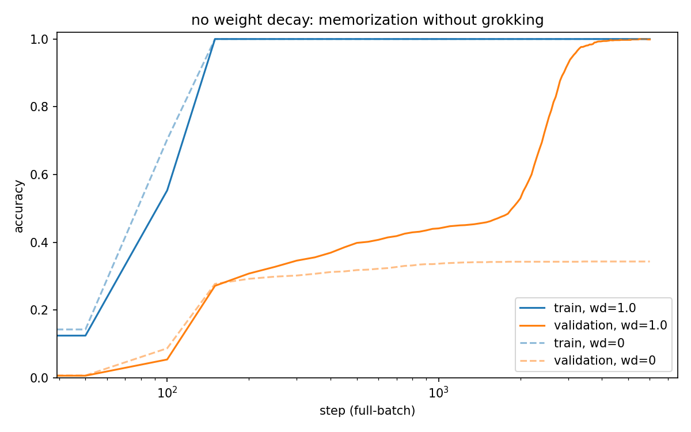

# Why the general solution wins

The README says weight decay causes grokking because a general mechanism needs less total weight than a memorized lookup table. This file works that claim out in full, then checks it against the numbers in the committed runs. Everything below is about the `fast` preset: p = 53, so the task is the 53 times 53 = 2809 possible additions modulo 53, of which the model trains on 1264 pairs and is tested on the other 1545. (Modulo means remainder: 60 mod 53 = 7, so addition wraps around like hours on a clock with 53 hours.)

## what weight decay does each step

Weight decay is a penalty on the size of the weights themselves, applied by the optimizer on every training step. This repo trains with AdamW, and AdamW applies decay separately from the gradient: each step, every parameter is first multiplied by (1 - learning rate times weight decay), and only then does the gradient update get added. Here the learning rate is 0.001 and weight decay is 1.0, so the shrink factor is 0.999 per step.

That number looks harmless and is not. A weight that receives no gradient gets multiplied by 0.999 every step, so it halves every 693 steps (0.999 to the power 693 is about 0.5) and by step 6000 sits at 0.25 percent of wherever it started. Training at the `fast` preset lasts exactly 6000 steps, so an unsupported weight is effectively erased over the run.

The way to read this: every weight pays rent every step, at a rate proportional to its own size, and survives only if the gradient keeps earning back what the rent removes. Once a weight stops earning, it does not stay put. It melts.

## what memorization costs

Memorization means storing each training answer separately, the way a lookup table does. To memorize the pair (7, 40), the network needs weights that switch on for that pair and push the logit of 47 up. Those weights help with no other pair. The next pair needs its own weights, and so on 1264 times.

Two costs follow. The total weight grows with the number of memorized pairs, because each pair brings its own private machinery. And each of those weights earns gradient from a tiny slice of the data, one pair out of 1264, while paying the same per-step rent as every other weight. Once training accuracy is perfect and the loss is nearly zero, that income stops entirely, and the rent does not.

Confidence makes it worse. Cross entropy, the loss used here, is never fully satisfied: pushing the right logit higher always lowers the loss a little more. A memorizer that is left alone keeps inflating its private weights to buy certainty it already has. In the committed run with weight decay switched off, the train loss ends at 1.7 times 10 to the minus 10, and the total weight norm is still growing at step 6000.

## what the general solution costs

The general solution computes the answer instead of storing it. The embedding (the table that maps each of the 54 tokens to a vector of 96 numbers, one row per token) ends up placing each number n at an angle of 2 pi k n / 53 on a circle, for a handful of choices of k. Adding two numbers then means rotating by the second angle, which sines, cosines, and the sum-of-angles identities from school trigonometry handle exactly. The README's Fourier section has the picture.

The cost structure is the opposite of the table's. One set of weights, the sine and cosine components at a few frequencies, answers all 2809 pairs at once, including the 1545 the model never saw. The cost does not grow with the dataset, and every one of those weights earns gradient from every pair on every step. Under rent, that income is 2809 times wider than a table weight's.

## why the table still wins first

Gradient descent takes the steepest available improvement. Memorizing one pair immediately cuts the loss on that pair by a lot, so early in training the table direction is steep. A half-built rotation circuit helps every pair only slightly, so its gradient is smaller per step even though its total payoff is larger. The model buys the expensive solution first because it is the fast one.

The norm trace in `runs/fast/log.csv` shows the purchase. The model starts at a total parameter norm of 36.1 (random init), memorizes the training set by step 150, and at that point the norm has grown to 46.2. Those extra 10 units of weight are the table.

## the flat stretch is a cleanup

From step 150 on, training accuracy is 100 percent and the train loss keeps sinking: 2.4 times 10 to the minus 6 by step 1000, 1.3 times 10 to the minus 7 by step 2000. The gradient on the table's private weights dries up. The rent continues. The total norm then falls at every logged step for the rest of the run:

| step | total norm | validation accuracy |
|---|---|---|
| 0 | 36.1 | 0.02 |
| 150 | 46.2 | table complete |
| 500 | 44.6 | 0.40 |
| 1000 | 43.6 | 0.44 |
| 1500 | 39.7 | 0.46 |
| 2000 | 36.2 | 0.53 |
| 2500 | 33.8 | 0.75 |
| 3000 | 31.6 | 0.93 |
| 3150 | 31.0 | 0.95 (grokked) |
| 6000 | 25.5 | 1.00 |

From step 500 to 1500, validation accuracy hardly moves (0.40 to 0.46) while the norm drops from 44.6 to 39.7. Accuracy cannot show the cleanup, because a held-out pair counts as correct only when the right logit is the largest one. The decaying table still contributes large, wrong logits on pairs it never memorized, and it outvotes the smaller circuit until it has melted far enough. The weight budget is where the progress is visible.

The spectrum shows the construction directly (`figures/evolution.png`, made from embedding snapshots saved during the run). The four frequencies that will win are already the four largest at step 1000, holding 32 percent of the embedding power against the 15 percent a diffuse embedding would give any four, while validation accuracy is still 0.44. By step 2000 they hold 43 percent. The circuit is being built all through the flat stretch; accuracy is simply the last place it shows.

Two honest notes on the shape. At the `fast` preset the held-out curve does not sit at chance during the wait. Chance is 1/53, about 0.02, and the curve creeps from 0.40 to 0.53 over steps 500 to 2000, because a table that covers 45 percent of the space already beats chance on the rest: held-out pairs share operands with memorized ones, and the weights learned for the table answer some of them correctly by accident. This is what makes validation accuracy a poor progress measure during the wait. It moves for reasons that have nothing to do with the circuit being built, and the norm trace is where the real progress shows. The `paper` preset trains on only 30 percent of pairs and shows the cleaner version: validation accuracy is 0.07 at step 1000, 0.10 at step 3000, and 0.21 at step 5000, then 0.97 at step 7000. Same mechanism, flatter wait. The exact step counts and the level of the creep also move with the seed; the norm pattern does not.

## why the switch is quick when it comes

Decay is exponential, which produces a long wait followed by a fast finish. For thousands of steps the table's leftover weight on unseen pairs is larger than the circuit's, and nothing changes on the accuracy curve. But the leftover halves every 693 steps while the circuit's shared weights hold their size, so once the two are close, the crossover completes quickly. In the run above, validation accuracy goes from 0.75 to 0.95 in the 650 steps between 2500 and 3150, after taking 2500 steps to get from 0.40 to 0.75.

The end state is worth a number of its own. The finished generalizer, correct on all 2809 pairs, has a total norm of 25.5. The random network it started from was 36.1, and the memorizer it briefly became was 46.2. The path from memorizer to generalizer lost 21 units of weight. What survived the cleanup is the cheap circuit that had been growing underneath the whole time.

## the counterfactual: weight decay off

`runs/fast-wd0/` is the same model, same seed, same data, same 6000 steps, with one flag changed: `--wd 0`. It is the control experiment for everything above, and it carries the clearest version of the argument in this file.

The circuit forms without weight decay. Apply a discrete Fourier transform (a re-expression of each embedding row as a sum of cosines and sines over the 53 token positions, so you can see which rotation frequencies the model uses) to the final embeddings of both runs. The grokked model puts 94 percent of its embedding power on four frequencies: k = 1, 3, 9, 25. The wd0 model never generalizes, yet the same four frequencies are already its four largest, holding 24 percent of the power. The rotation circuit grew on its own, without any decay, because it genuinely helps with the training loss. Weight decay's job in grokking is deleting the competitor. The wd0 embedding carries 204 units of total power against the grokked model's 103, and the extra weight is the table, smeared over every frequency with the largest of them holding only 6.6 percent.

The curves tell the same story from the outside. With no rent, nothing melts: the run memorizes at the same step 150, the total norm climbs from 49.6 to 55.8 and never falls, and validation accuracy plateaus at 0.343, above chance and nowhere near generalization, for the whole run. The validation loss grows to 28.4: the model becomes ever more confident and stays wrong. The figure `figures/wd0.png` shows both runs on one axis.



## check it yourself

```
OMP_NUM_THREADS=10 python grok.py --preset fast --snap-steps 0,1000,2000,6000
OMP_NUM_THREADS=10 python grok.py --preset fast --wd 0 --out runs/fast-wd0
python plot.py --run runs/fast --wd0 runs/fast-wd0   # redraws wd0.png and evolution.png
pytest -q                                            # includes the assertions on both runs
```

Each run is about five minutes on a laptop cpu. The thread count is pinned because BLAS sums in a different order at different counts and the low bits move; at 10 threads these commands reproduce the committed logs bitwise (on windows cmd, use `set OMP_NUM_THREADS=10` instead of the prefix).

The test suite asserts the claims in this file against the committed logs and checkpoints: the `fast` run memorizes early, waits, then generalizes, the `wd0` run memorizes and never generalizes, and the grokked embedding concentrates on four frequencies.
